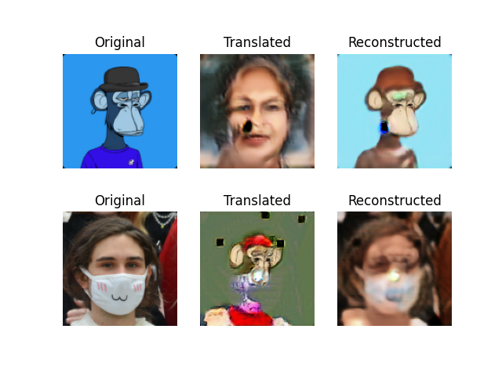

# cycle-gan-apes


## inspired by
 
```

https://opensea.io/collection/acid-gan-apes
https://twitter.com/gannft?lang=en

https://github.com/nathancooperjones/thisboredapedoesnotexist

dataset

ape

https://github.com/skogard/apebase/tree/3fac3b040a4213a04b3fd8cef9e6d341478873a3

human face - celeba, flickr
https://github.com/keras-team/keras-io/blob/master/examples/generative/dcgan_overriding_train_step.py#L22

above resolution too small, human-to-ape have artifacts, likely due to jpg compression & resizing.
attempting to use the below png with higher resolution.
https://github.com/mazzzystar/make-CelebA-HQ/blob/master/README.md

# switched to below flickr dataset, using the 1024x1024 version for now
https://github.com/NVlabs/ffhq-dataset


@Jason
Can someone make a version of me as a bored ape for $100?
https://twitter.com/Jason/status/1468341195734601732


cyclegan

https://github.com/eriklindernoren/Keras-GAN/tree/master/cyclegan

```

## notes                                                                                                     
                                                    
```                                       

docker build -t apes .
                                                                                    
docker run -it -p 6006:6006 -w /workdir -v $PWD:/workdir -v /mnt/hd2:/mnt/hd2 apes bash

# download data
python download.py
bash download.sh

# move the downloaded data to desired locations and modify paths accordingly in `data_loader.py`

# train
CUDA_VISIBLE_DEVICES=0 python cyclegan_unet.py

# inference
CUDA_VISIBLE_DEVICES=1 python inference.py static/jason-calacanis.jpg static/ape-jason.png


CUDA_VISIBLE_DEVICES=0 python cyclegan_resnet.py

tensorboard --logdir=log --bind_all

``` 

## sample image at epoch 0 batch 1000 
 
+ hyperparameters from keras example was left untouched.
+ data size, apes n=10k, celeba n=202.599k, then switched to flickr faces dataset
+ 200 epochs, batch size of 1, each epoch is 10k samples
+ unet arch seems too shallow, may need to add few more res layers, regardless, fun 2 hr project and will leave model to train overnight, let see what we get tomorrow



