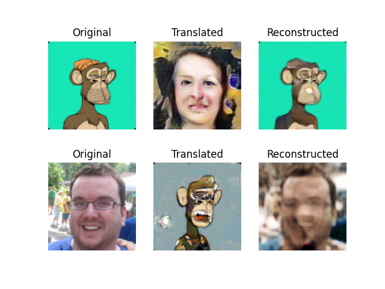

# cycle-gan-apes

## motivation

```

Few days a go, saw a tweet from @Jason 

"Can someone make a version of me as a bored ape for $100?"
https://twitter.com/Jason/status/1468341195734601732

And later, with a few searches found @natecooperjones 's  `thisboredapedoesnotexist`, which is super cool.
https://github.com/nathancooperjones/thisboredapedoesnotexist

Thought to myself why not waste a few hours to train a vanilla cycle-gan to generate personalized apes? a guesstimated 2 hr project later turned to a weekend project...

nn architectures copy pasted straight from below:
resnet: https://github.com/keras-team/keras-io/blob/master/examples/generative/cyclegan.py
unet: https://github.com/eriklindernoren/Keras-GAN/tree/master/cyclegan


```

## sample image at ~ epoch 10



# usage
          
```                                       
# build and run container.
docker build -t apes .                                                                                    
docker run -it -p 6006:6006 -w /workdir -v $PWD:/workdir -v /mnt/hd2:/mnt/hd2 apes bash

# download data (not actual instructions)
python download.py
bash download.sh
# flickr dataset was obtained via academic torrent

# move the downloaded data to desired locations and modify paths accordingly in `data_loader.py`

# train
CUDA_VISIBLE_DEVICES=0 python cyclegan_unet.py
# ^^^above is abandoned.

CUDA_VISIBLE_DEVICES=0 python cyclegan_resnet.py
# traing along side, since resnet generator weights are updated
CUDA_VISIBLE_DEVICES=1 python upsample.py

# monitor
tensorboard --logdir=log --bind_all


# inference
CUDA_VISIBLE_DEVICES=1 python inference.py static/jason-calacanis.jpg static/ape-jason.png


``` 

## misc notes
 
+ initially, hyperparameters from keras example was left untouched.
+ initials dataset used was bored apes data size, apes n=10k, celeba n=202.599k.
+ unet arch seems too shallow, may need to add few more res layers, regardless, fun 2 hr project and will leave model to train overnight, let see what we get tomorrow
+ suspecting skip connections in unet causing human2ape model not yield good ape faces
+ switched to resnet
+ ape2human generator yielding decent results, but human2ape have checkerboard artifacts
+ switched human-face dataset from celeba jpg to flickr 1024x1024 png
+ still getting checkerboard artifacts
+ switched upsampling layer from conv-transpose to upsample
+ additionally added more aggressive augmentation for ape dataset
+ added upsample neural net just for fun
+ training using 2 Nvidia GTX 1070 8GB (1 for cyclegan, 1 for upsampling)
+ results likely could be much better if using natecooperjones's generator and upsampling architectures.


## references
 
```

https://opensea.io/collection/acid-gan-apes
https://twitter.com/gannft?lang=en

https://github.com/nathancooperjones/thisboredapedoesnotexist

dataset

ape

https://github.com/skogard/apebase/tree/3fac3b040a4213a04b3fd8cef9e6d341478873a3

human face - celeba, flickr
https://github.com/keras-team/keras-io/blob/master/examples/generative/dcgan_overriding_train_step.py#L22

above resolution too small, human-to-ape have artifacts, likely due to jpg compression & resizing.
attempting to use the below png with higher resolution.
https://github.com/mazzzystar/make-CelebA-HQ/blob/master/README.md

# switched to below flickr dataset, using the 1024x1024 version for now
https://github.com/NVlabs/ffhq-dataset

@Jason Can someone make a version of me as a bored ape for $100?
https://twitter.com/Jason/status/1468341195734601732


cyclegan

resnet https://github.com/keras-team/keras-io/blob/master/examples/generative/cyclegan.py
unet https://github.com/eriklindernoren/Keras-GAN/tree/master/cyclegan

```

