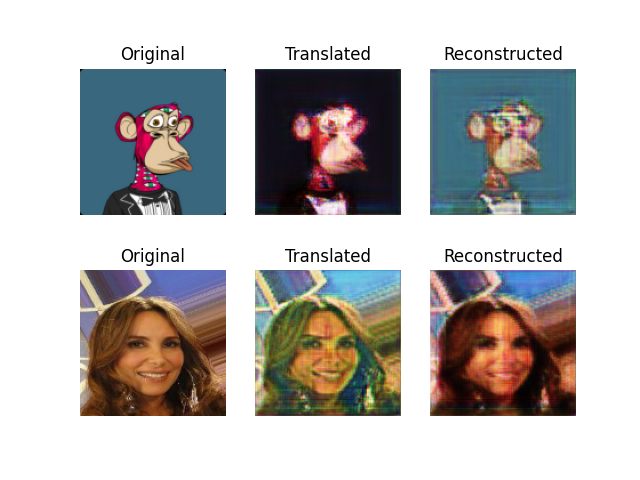

# cycle-gan-apes


## inspired by
 
```

https://opensea.io/collection/acid-gan-apes
https://twitter.com/gannft?lang=en

https://github.com/nathancooperjones/thisboredapedoesnotexist

dataset

ape

https://github.com/skogard/apebase/tree/3fac3b040a4213a04b3fd8cef9e6d341478873a3

human face - celeba

https://github.com/keras-team/keras-io/blob/master/examples/generative/dcgan_overriding_train_step.py#L22


@Jason
Can someone make a version of me as a bored ape for $100?
https://twitter.com/Jason/status/1468341195734601732


cyclegan

https://github.com/eriklindernoren/Keras-GAN/tree/master/cyclegan

```

## notes                                                                                                     
                                                    
```                                       

docker build -t apes .
                                                                                     
docker run -it -w /workdir -v $PWD:/workdir -v /mnt/hd0:/mnt/hd0 apes bash                               

# download data
python download.py
bash download.sh

# move the downloaded data to desired locations and modify paths accordingly in `data_loader.py`

# train
CUDA_VISIBLE_DEVICES=0 python cyclegan.py
                                                                                                            
``` 

## sample image - hyperparameters from keras example was left untouched.


